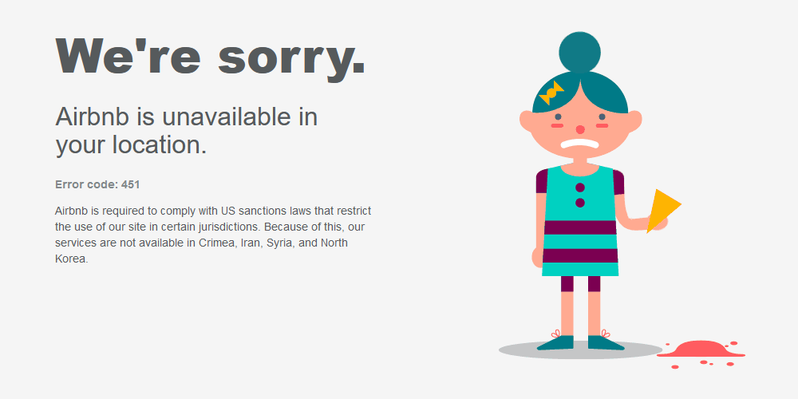

# Sanctions against Islamic Republic of Iran


> These pictures are familiar to you if you are Iranian. There is also a similar picture of [IP blocking by Google](assets/google-ip-blocking.jpg) that developers face a lot of this problem.


**English** - (Other languages: [Persian](README.FA.md))


![So do not weaken and call for peace while you are superior; and Allah is with you and will never deprive you of [the reward of] your deeds. Muhammad [47:35] - Quran](assets/Quran-Muhammad-Aya35-AR+EN.png "Muhammad [47:35] - Quran")

Read Quran [Surah Muhammad [47:19]](http://tanzil.net/#trans/en.sahih/47:35)


## Story

After the [1979 Islamic Revolution](https://english.khamenei.ir/Opinions/IRevolution), heavy [US-led international sanctions](https://www.treasury.gov/resource-center/sanctions/programs/pages/iran.aspx) were imposed to put pressure on the people and the government to prevent Iran from moving toward benevolent goals. Most of these sanctions were based on false pretenses such as Iran's access to nuclear weapons and support for terrorism. They are forming and feeding ISIS against you at a heavy cost. And then shamelessly admit it. When you overthrow the ISIS government, the resistance commanders are cowardly assassinated. And strangely enough, then they call your commander a terrorist and you a terrorist nation. They safeguard the killers of thousands of Iranians and hold conferences with them to overthrow the "Iranian regime". At the same time, they prevent you from defending. Is this really human rights?


Although your country is being boycotted under various pretexts, the sanctions do not end here. Sanctions are not limited to government organizations and groups, but affect the lives of all Iranians living there. In this list, we will see a number of Internet sanctions that have affected technology, computers and programming in related fields.

See: [US Treasury sanctions against Iran](https://www.treasury.gov/resource-center/sanctions/programs/pages/iran.aspx)

## List

**Note**: This list of sanctions only includes technology, computers and programming in related fields. These items have been listed for a variety of reasons, including IP blocking or cessation of export trade. Refer to the [archive](/archives) to view older lists.

### Operating system
* [Android](https://www.android.com/) - [Google privacy and terms](https://policies.google.com/terms)
* [BlackBerry OS](https://www.blackberry.com/us/en/products/devices/software/smartphones/update-blackberry-10-os) - [BlackBerry Legal Information](https://www.blackberry.com/us/en/legal)
* [Chrome OS](https://www.google.com/chromebook/chrome-os/) - [Google privacy and terms](https://policies.google.com/terms) 
* [iOS](https://www.apple.com/ios/) - [Apple Global Trade](https://www.apple.com/legal/more-resources/gtc.html)
* [iPadOS](https://www.apple.com/ipados/) - [Apple Global Trade](https://www.apple.com/legal/more-resources/gtc.html)
* [Mac OS](https://www.apple.com/macos) - [Apple Global Trade](https://www.apple.com/legal/more-resources/gtc.html)
* [Red Hat Enterprise Linux](https://access.redhat.com/products/red-hat-enterprise-linux) - [Export Control Product Matrix](https://www.redhat.com/en/about/export-control-product-matrix) - Membership is required for download. If you register, your account will be suspended and you will be shown the [Export Hold article](https://access.redhat.com/articles/1340183).
* [tvOS](https://www.apple.com/tv/) - [Apple Global Trade](https://www.apple.com/legal/more-resources/gtc.html)
* [watchOS](https://www.apple.com/watch/) - [Apple Global Trade](https://www.apple.com/legal/more-resources/gtc.html)
* [Windows](https://www.microsoft.com/en-us/windows/) - [Microsoft Exporting Rules](https://www.microsoft.com/en-us/exporting/overview.aspx)


### Device & driver
* [Dell](https://www.dell.com) - [Consumer Terms of Sale](https://www.dell.com/learn/us/en/uscorp1/terms-of-sale-consumer)
* [HP](https://support.hp.com/us-en/drivers/) - [Terms and conditions](https://store.hp.com/us/en/cv/termsandconditions) - *With IP Blocking (```HTTP 403```)*
* [I-Life](https://www.lifedigital.com/) - *With IP Blocking (```No response```)*
* [Intel](https://downloadcenter.intel.com/) - *With IP Blocking (```No response```)*
* [lenovo](https://www.lenovo.com/) - *With IP Blocking (```HTTP 403```)*
* [SanDisk](https://www.sandisk.com/) - *With IP Blocking (```HTTP 403```)*
* [Sony](http://dlv.update.sony.net/) - *With IP Blocking (```HTTP 403```)*

### Software development kit (SDK)
* [Android](https://developer.android.com/studio) - [Google privacy and terms](https://policies.google.com/terms) - *With IP Blocking (```HTTP 403```)*
* [Go lang](https://golang.org/) - [Google privacy and terms](https://policies.google.com/terms) - *With IP Blocking (```HTTP 403```)*
* [Intel C++ Compiler](https://software.intel.com/content/www/us/en/develop/tools/compilers/c-compilers.html) - *With IP Blocking (```No response```)*
* [Java](https://www.oracle.com/java/technologies/javase-downloads.html) - [License Agreement](https://www.oracle.com/downloads/licenses/javase-license1.html)
* [Qt](https://www.qt.io/) - except use Qt under the (L)GPL
* [RedHat OpenJDK](https://developers.redhat.com/products/openjdk/download) - Membership is required for download. If you register, your account will be suspended and you will be shown the [Export Hold article](https://access.redhat.com/articles/1340183).
* [.Net Framework](https://dotnet.microsoft.com/download/dotnet-framework) - except .Net core or .Net (>=5) - Windows is restricted

### Database management system (DBMS)
* [IBM Db2](https://www.ibm.com/products/db2-database) - [Export Compliance](https://www-03.ibm.com/products/exporting/)
* [Microsoft SQL Server](https://www.microsoft.com/sql-server) - [Microsoft Exporting Rules](https://www.microsoft.com/en-us/exporting/overview.aspx)
* [Microsoft Access](https://www.microsoft.com/en-us/exporting/overview.aspx) - [Microsoft Exporting Rules](https://www.microsoft.com/en-us/exporting/overview.aspx) - Windows and Office are restricted
* [MySQL](https://www.mysql.com/) - except community edition
* [Oracle](https://www.oracle.com/database/technologies/oracle-database-software-downloads.html) - [Oracle Global Trade Compliance](https://www.oracle.com/corporate/security-practices/corporate/governance/global-trade-compliance.html)

### Integrated development environment & code editor
* [Android Studio](https://developer.android.com/studio) - [Google privacy and terms](https://policies.google.com/terms) - *With IP Blocking (```HTTP 403```)*
* [IntelliJ IDEA](https://www.jetbrains.com/idea/) - [Export Regulations](https://www.jetbrains.com/legal/agreements/user.html) - except community edition
* [PhpStorm](https://www.jetbrains.com/phpstorm/) - [Export Regulations](https://www.jetbrains.com/legal/agreements/user.html)
* [PyCharm](https://www.jetbrains.com/pycharm/) - [Export Regulations](https://www.jetbrains.com/legal/agreements/user.html) - except community edition
* [RubyMine](https://www.jetbrains.com/ruby/) - [Export Regulations](https://www.jetbrains.com/legal/agreements/user.html)
* [Qt](https://www.qt.io/) - [Licensing](https://www.qt.io/licensing/) - except use Qt under the (L)GPL
* [Sublime Text](https://www.sublimetext.com/) - except for limited use
* [Visual Studio](https://visualstudio.microsoft.com/downloads/) - community edition is free but Windows is restricted
* [Visual Studio Online](https://online.visualstudio.com/login) - [Microsoft Exporting Rules](https://www.microsoft.com/en-us/exporting/overview.aspx) - Requires an Azure subscription, while it is not possible to purchase a subscription, albeit for free.
* [WebStorm](https://www.jetbrains.com/webstorm/) - [Export Regulations](https://www.jetbrains.com/legal/agreements/user.html)

### Cloud computing service provider
* [Alibaba Cloud](https://www.alibabacloud.com) - [Terms of Service](https://www.alibabacloud.com/help/doc-detail/42416.htm)
* [Amazon Web Services](https://aws.amazon.com/) - [AWS Customer Agreement](https://aws.amazon.com/agreement/)
* [Cloudflare](https://www.cloudflare.com/) - [Subscription Agreement](https://www.cloudflare.com/terms/)
* [Google Cloud Platform](https://cloud.google.com/) - [Google privacy and terms](https://policies.google.com/terms) - *With IP Blocking (```HTTP 403```)*
* [Microsoft Azure](https://azure.microsoft.com/) - [Microsoft Exporting Rules](https://www.microsoft.com/en-us/exporting/overview.aspx) - When registering an [Azure account](https://azure.microsoft.com/en-us/account/), Iran is not registered in the list of countries.

### Git repository hosting service
* [GitHub](https://github.com/) - [GitHub and Trade Controls](https://docs.github.com/en/github/site-policy/github-and-trade-controls)
* [GitLab](https://about.gitlab.com/) - [GCP migration notes](https://about.gitlab.com/blog/2018/07/19/gcp-move-update/): GitLab may not be accessible after the migration to Google.
  
### Content delivery network providers
* [Amazon CloudFront](https://aws.amazon.com/) - [AWS Customer Agreement](https://aws.amazon.com/agreement/)
* [Cloudflare](https://www.cloudflare.com/) - [Subscription Agreement](https://www.cloudflare.com/terms/)
* [Google Cloud CDN](https://cloud.google.com/cdn) - [Google privacy and terms](https://policies.google.com/terms) - *With IP Blocking (```HTTP 403```)*
* [Microsoft Azure CDN](https://azure.microsoft.com/en-us/services/cdn/) - [Microsoft Exporting Rules](https://www.microsoft.com/en-us/exporting/overview.aspx)
* [StackPath](https://www.stackpath.com/products/cdn/) - [Master Service Agreement](https://www.stackpath.com/legal/master-service-agreement/)

### App Store & Software repository
* [Apple App Store](https://apps.apple.com/us/app/apple-store/id375380948) - [Terms and Conditions](https://www.apple.com/legal/internet-services/itunes/us/terms.html) - Apple operating systems are restricted - A significant number of applications were removed from the App Store. [Follow discussions](https://discussions.apple.com/search?q=iranian%20apps) to see instances.
* [Google Code Archieve](https://code.google.com/archive/) - [Google privacy and terms](https://policies.google.com/terms) - *With IP Blocking (```HTTP 403```)*
* [Google Play Store](https://play.google.com/) - [Google privacy and terms](https://policies.google.com/terms) - A significant number of applications were removed from the Play Store. [Follow help center](https://support.google.com/googleplay/search?q=iranian+apps) to see instances.
* [FileHippo](https://filehippo.com/) - Seems to be using Google Cloud Platform. See [Google privacy and terms](https://policies.google.com/terms) - *With IP Blocking (```HTTP 403```)*

### Educational sites
<sup>It is not possible to buy paid educational content unless it is available for free.</sup>

* [Codecademy](https://www.codecademy.com/terms)
* [Code with Mosh](https://codewithmosh.com/) - Seems to be using Cloudflare. See [Subscription Agreement](https://www.cloudflare.com/terms/) - *With IP Blocking (```HTTP 403```)*
* [Coursera](https://www.coursera.org/about/terms)
* [GitLab docs](http://docs.gitlab.com/) - *With IP Blocking (```No response```)*
* [JavaScript.com](https://www.javascript.com/) - *With IP Blocking (```No response```)*
* [JSON.org](https://www.json.org) - *With IP Blocking (```No response```)*
* [Lynda](https://www.lynda.com/aboutus/lotterms.aspx)
* [Udacity](https://www.udacity.com/legal/en-us/terms-of-use)
* [Udemy](https://www.udemy.com/)

### Web Services
* [Alexa](https://www.alexa.com/)
* [Algolia](https://www.algolia.com/) - Seems to be using Cloudflare. See [Subscription Agreement](https://www.cloudflare.com/terms/) - *With IP Blocking (```HTTP 403```)*
* [Bootstrap](https://getbootstrap.com/) - Uses Algolia to search for documents. Which has blocked Iran's IP.
* [Debuggex](https://www.debuggex.com/) - *With IP Blocking (```No response```)*
* [Google Analytics](https://analytics.google.com/analytics/web/) - [Google privacy and terms](https://policies.google.com/terms) - *With IP Blocking (```HTTP 403```)*
* [Google Developers](https://developers.google.com/) - [Google privacy and terms](https://policies.google.com/terms) - *With IP Blocking (```HTTP 403```)*
* [Google Material](https://material.io/) - [Google privacy and terms](https://policies.google.com/terms) - *With IP Blocking (```HTTP 403```)*
* [Google Data Studio](https://datastudio.google.com/) - [Google privacy and terms](https://policies.google.com/terms) - *With IP Blocking (```HTTP 403```)*
* [Grafana](https://grafana.com/) - Seems to be using Google Cloud Platform. See [Google privacy and terms](https://policies.google.com/terms) - *With IP Blocking (```HTTP 403```)*
* [Internet Information Services](https://www.iis.net/) - [Microsoft Exporting Rules](https://www.microsoft.com/en-us/exporting/overview.aspx) - (*Windows is restricted*)
* [jsDelivr](http://www.jsdelivr.com/) - Uses Algolia to search. Which has blocked Iran's IP.
* [Font Awesome](https://fontawesome.com/) - except for free use
* [Olark](https://www.olark.com/) - Seems to be using Google Cloud Platform. See [Google privacy and terms](https://policies.google.com/terms) - *With IP Blocking (```HTTP 403```)* 

### Team instant messaging
* [Cisco WebEx](http://www.webex.com/) - *With IP Blocking (```HTTP 301``` → ```No response```)*
* [Microsoft Teams](https://www.microsoft.com/en-us/exporting/overview.aspx) - Iran is not registered in the list of countries.
* [Slack](https://slack.com/) - [Global Trade Compliance](https://slack.com/intl/en-ir/help/articles/360020783254-Global-Trade-Compliance-) - Prevents the creation of workspace.

### Social networking apps
* [Instagram](https://www.instagram.com/) - Many posts were removed by Instagram (under the pretext of violating the [Community Guidelines](https://help.instagram.com/477434105621119)).

### Applications or Services
<sup>These applications or services may be paid or in-app purchases or may use IP blocking for deprivation.</sup>

* [Adobe Creative Cloud](https://www.adobe.com/creativecloud.html)
* [Airbnb](https://www.airbnb.com/) - *With IP Blocking ([```HTTP 403```](https://www.airbnb.com/region_unavailable/index.html))*
* [Amazon](https://www.amazon.com/)
* [Avast](https://www.avast.com/) - *With IP Blocking (```HTTP 403```)*
* [AVG](https://www.avg.com/) - *With IP Blocking (```No response```)*
* [Avira](https://www.avira.com/)
* [BitDefender](https://www.bitdefender.com/)
* [eBay](http://www.ebay.com/)
* [Epic Games](https://www.epicgames.com/) - [FAQ from billing support](https://www.epicgames.com/help/en-US/billing-support-c99/general-support-c102/what-regions-are-permitted-to-make-purchases-with-epic-games-a3323) - *With IP Blocking (In-app)*
* [ESET](https://www.eset.com/)
* [GlassWire](https://www.glasswire.com/) - [Terms of Use](https://www.glasswire.com/license/)
* [GNU Privacy Guard](https://gnupg.org/) - Read [GNU Licenses FAQ](https://www.gnu.org/licenses/gpl-faq.en.html#ExportWarranties) - *With IP Blocking (```No response```)*
* [Internet Download Manager](http://www.internetdownloadmanager.com)
* [Kaspersky](https://www.kaspersky.com/)
* [McAfee](https://www.mcafee.com/en-us/index.html)
* [Malwarebytes](https://www.malwarebytes.com/)
* [Microsoft Defender](https://www.microsoft.com/en-us/windows/comprehensive-security) - [Microsoft Exporting Rules](https://www.microsoft.com/en-us/exporting/overview.aspx) - *(Windows is restricted)*
* [Microsoft Office](https://www.office.com/) - [Microsoft Exporting Rules](https://www.microsoft.com/en-us/exporting/overview.aspx) - *(Windows is restricted)* - except [Office Online](https://www.office.com)
* [Milkshake App](https://milkshake.app/) - Seems to be using Cloudflare. See [Subscription Agreement](https://www.cloudflare.com/terms/) - *With IP Blocking (```HTTP 403```)*
* [Norton AntiVirus](https://us.norton.com/) - *With IP Blocking (```HTTP 200``` - [Static web page](http://buy-static.norton.com/estore/html/EmbargoedCountriesPage.html))*
* [TeamViewer](https://www.teamviewer.com/)
* [TechSmith Camtasia](https://www.techsmith.com/store/camtasia)
* [TechSmith Snagit](https://www.techsmith.com/store/snagit)
* [TensorFlow](https://www.tensorflow.org/) - Seems to be using Google Cloud Platform. See [Google privacy and terms](https://policies.google.com/terms) - *With IP Blocking (```HTTP 403```)*
* [Uber](https://www.uber.com/) - Seems to be using Google Cloud Platform. See [Google privacy and terms](https://policies.google.com/terms) - *With IP Blocking (```HTTP 403```)*
* [VMware](https://www.vmware.com/)
* [WinRAR](https://www.win-rar.com)
* [YouTube](https://www.youtube.com/) - It is also blocked according to [Iranian internet regulations](https://internet.ir/crime_index.html).

## Solution

If you are Iranian, [Shecan](https://shecan.ir/) is a solution to the fight against sanctions That's good software for dealing with oppressive sanctions. Applicable for individuals and businesses. Thanks to the Shecan.


### Similar projects or activities

* [@sajad-sadra](https://github.com/sajad-sadra) / [iran-domains-sanction](https://github.com/sajad-sadra/iran-domains-sanction)
* [@1995parham](https://github.com/1995parham) / [github-do-not-ban-us](https://github.com/1995parham/github-do-not-ban-us)
* [@alibo](https://github.com/alibo) / [iran-sanctions_blocker-sites.csv (gist)](https://gist.github.com/alibo/dfd7c258bcc44a0e8c9f7c5bfd3bd2c3)